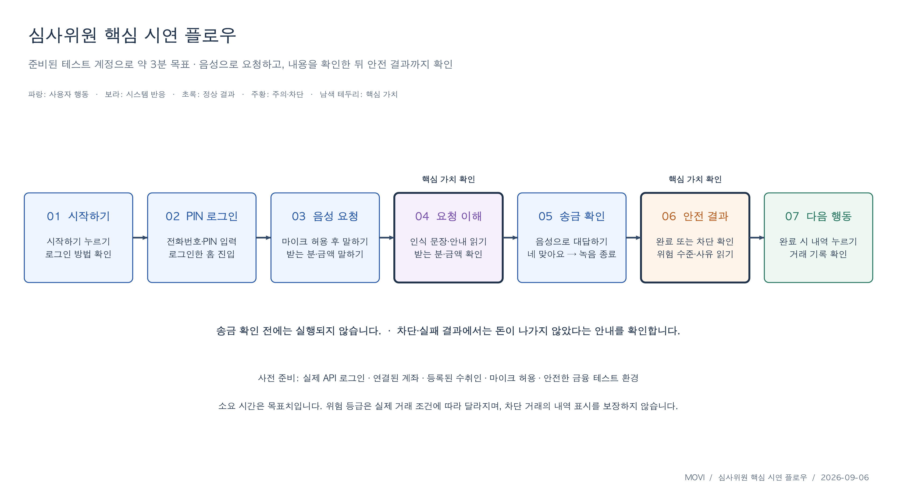
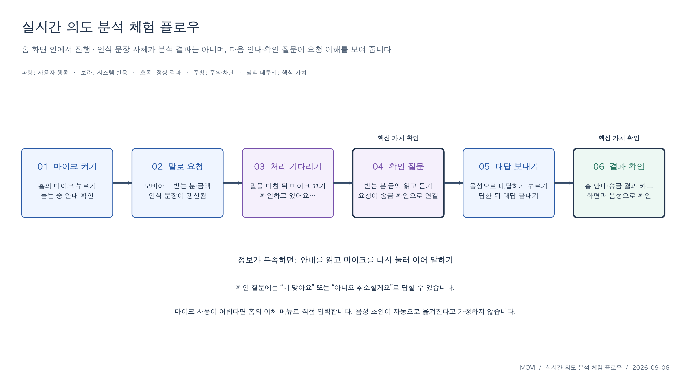

# MOVI

시각 중심의 금융 UI 이용에 어려움이 있는 사용자를 고려해,  
음성으로 계좌 조회와 송금 과정을 보조하는 금융 서비스 프로토타입입니다.

MOVI는 **음성 AI가 인식한 수취인·금액을 그대로 금융 실행으로 연결하지 않습니다.**  
AI는 사용자의 발화를 해석하고, Backend가 실제 계좌·수취인·금액·권한·한도와 거래 상태를 다시 검증한 뒤 사용자의 명시적 확인을 거쳐 송금을 실행하도록 설계했습니다.

> 이 저장소는 MOVI의 포트폴리오용 Overview / Case Study입니다.  
> 실제 코드는 Frontend, Backend, AI 저장소에 분리되어 있습니다.  
> 프로젝트는 실제 상용 금융 서비스가 아니라 **Mock 기반 금융 환경에서 핵심 사용자 흐름과 시스템 통합 구조를 검증한 팀 프로젝트**입니다.

---

## 1. Project Overview

- **프로젝트명:** MOVI
- **형태:** 4인 팀 프로젝트
- **문제 영역:** 금융 접근성, 음성 인터페이스, AI 결과 검증, 안전한 거래 흐름
- **핵심 사용자:** 시각 중심 UI 이용에 어려움이 있는 사용자
- **주요 기능:** 계좌/잔액 조회, 음성 송금, 누락 정보 재질문, 최종 확인, FDS 기반 위험 분기, 보호자 위험 알림
- **개발 구조:** Frontend / Backend / AI 서버 분리

<p align="center">
  
</p>

<p align="center"><sub>
Original demo scenario — 음성 요청 → 요청 내용 확인 → 송금 확인 → 안전 결과까지의 핵심 사용자 경험을 정리한 시연 자료입니다. 세부 연동 방식은 이후 구현 과정에서 변경되었습니다.
</sub></p>

---

## 2. Problem

음성 인터페이스는 화면 조작이 어려운 사용자에게 대안이 될 수 있지만, 금융 서비스에서는 음성 인식 오류가 잘못된 거래로 이어질 수 있습니다.

MOVI에서는 다음 상황을 주요 위험으로 보았습니다.

- 수취인 또는 금액이 잘못 인식되는 경우
- 송금에 필요한 정보가 누락되는 경우
- 사용자가 최종 거래 내용을 확인하지 않은 경우
- 네트워크 오류나 재시도로 동일 요청이 반복 실행되는 경우
- AI 또는 FDS가 정상 응답하지 않는 경우
- 화면을 보기 어려운 사용자가 오류 원인이나 다음 행동을 파악하기 어려운 경우

그래서 **AI가 해석한 값과 금융 시스템이 실행할 값을 분리**하고, 실제 금융 상태와 거래 실행의 최종 책임을 Backend에 두는 구조를 설계했습니다.

---

## 3. Core Design Principles

### Accessibility

- 음성 기능에도 키보드·터치 기반 대안을 둡니다.
- 음성 인식만으로 인증이나 송금을 확정하지 않습니다.
- 수취인, 금액, 출금 계좌를 다시 확인할 수 있도록 합니다.
- 오류가 발생했을 때 사용자가 다음 행동을 알 수 있도록 재질문/오류 흐름을 구분합니다.

### AI Trust Boundary

- Frontend는 AI/FDS 서버를 직접 호출하지 않습니다.
- AI가 추출한 Intent/Entity만으로 금융 결과를 확정하지 않습니다.
- 계좌, 수취인, 소유권, 한도, 거래 상태는 Backend가 다시 검증합니다.
- 확인할 수 없는 값은 임의로 추정해 실행하지 않습니다.

### Safe Transaction

- 송금 전 검증된 거래 내용을 다시 제시하고 명시적 확인을 받습니다.
- 동일 요청의 중복 실행을 막기 위해 idempotency를 사용합니다.
- FDS 오류·timeout·잘못된 응답은 송금을 진행하지 않는 fail-closed 정책으로 처리합니다.
- 위험도에 따라 정상 완료 / 사후 알림 / 거래 차단으로 분기합니다.

---

## 4. Core User Flow

```text
사용자 음성 입력
      ↓
Frontend 녹음 / 전달
      ↓
Spring Backend
      ↓
Voice AI: STT + Intent / Entity 추출
      ↓
Backend 재검증
 ├─ 정보 누락 → 재질문
 ├─ 검증 실패 → 오류 안내
 └─ 검증 완료 → 거래 내용 확인
      ↓
사용자 명시적 확인
      ↓
FDS 평가
 ├─ LOW    → 송금 완료
 ├─ MEDIUM → 송금 완료 + 보호자 알림 요청
 └─ HIGH   → 송금 차단 + 보호자 알림 요청
      ↓
결과 안내
```

<p align="center">
  
</p>

<p align="center"><sub>
Original UX flow — 음성 요청부터 확인 질문과 결과 확인까지의 사용자 경험을 정리한 시연 자료입니다. 이 이미지는 UX 흐름 설명용이며, 현재 검증된 기술 구조는 아래 System Architecture와 <a href="./docs/architecture.md">architecture.md</a>를 기준으로 합니다.
</sub></p>

---

## 5. System Architecture

```text
[ User ]
   │
   ▼
[ Frontend ]
Next.js / React / TypeScript
   │
   ▼
[ Spring Backend ]
인증 · 세션 · 금융 상태 · 검증 · 거래 실행 책임
   │
   ├────────► [ Voice AI ]
   │           STT / Intent / Entity
   │
   ├────────► [ FDS AI ]
   │           Risk Assessment
   │
   └────────► [ Mock Financial Adapter ]
               Transfer / Account Flow
```

AI 서버와 AI 모델 구현은 별도 팀원이 담당했습니다.

---

## 6. My Contribution

제가 맡은 핵심은 **문제 정의, Frontend–Backend–AI 책임 경계 정리, 금융 실행 전 검증 구조 설계, AI-assisted 구현 및 동작 검증**입니다.

### 직접 수행한 내용

- 접근성 중심 금융 서비스의 문제 상황과 주요 사용자 흐름 정리
- Frontend–Backend–AI 간 호출 구조와 단일 책임 정의
- Voice / FDS API 요청·응답·오류·timeout·Mock 계약 문서화
- 음성 이체의 누락 정보 재질문, 확인/취소, FDS 분기, 멱등성, 실패 흐름 구현 및 검증
- Backend 실제 Controller/DTO와 Frontend 구현 간 계약 대조
- 직접 입력 송금에서 서버 검토 → 명시적 확인 → 실행 → 결과 표시 흐름 통합
- 실제 동작과 문서가 어긋나는 부분을 찾아 계약과 구현을 반복 점검

### 구현 방식

구현 과정에서 **Claude / Codex 등 AI 코딩 도구를 활용**했습니다.

요구사항과 책임 경계, 예외조건, 완료 조건을 먼저 정의하고,  
AI가 생성한 코드를 실행·테스트하면서 실제 요구사항과 일치하는지 확인하고 수정하는 방식으로 진행했습니다.

### 담당하지 않은 내용

- STT 모델 개발
- Intent / Entity AI 모델 개발
- FDS AI 모델 개발
- AI 서버 구현

### Representative PRs

- [Backend PR #3 — Front / AI / Backend 통합 명세 수립](https://github.com/movi-ai-challenge/movi_backend/pull/3)
- [Backend PR #35 — 음성 이체 명령 및 실행 흐름 구현](https://github.com/movi-ai-challenge/movi_backend/pull/35)
- [Frontend PR #14 — Backend-to-Frontend Contract Audit](https://github.com/movi-ai-challenge/movi_frontend/pull/14)
- [Frontend PR #28 — Direct Transfer API Flow 통합](https://github.com/movi-ai-challenge/movi_frontend/pull/28)

> PR의 코드량 자체를 개인 개발 역량의 근거로 사용하지 않습니다.  
> 구현에는 AI 코딩 도구가 활용되었으며, 이 Overview에서는 제가 직접 정의·검증한 문제, 계약, 흐름과 의사결정을 중심으로 설명합니다.

---

## 7. Key Decisions

### 1) AI가 금융 실행의 최종 판단자가 되지 않도록 분리

AI는 사용자의 언어를 해석하지만 실제 계좌·수취인·한도·권한을 알 수 없습니다.  
따라서 AI가 추출한 값은 Backend에서 다시 검증하고, 실제 금융 상태는 Backend가 단일 소유하도록 했습니다.

### 2) 누락 정보는 오류가 아니라 대화의 정상 분기로 처리

금액이나 수취인이 빠졌을 때 거래를 실패시키는 대신, 필요한 정보만 다시 질문하고 기존 세션에서 이어갈 수 있도록 했습니다.

### 3) 확인한 거래와 실행되는 거래를 일치시키기

금액·수취인·출금 계좌가 바뀌면 이전 확인 정보를 재사용하지 않도록 하고, 사용자가 확인한 내용과 실제 실행 값이 달라지지 않게 했습니다.

### 4) 중복 실행 방지

네트워크 timeout이나 재시도 상황에서 같은 송금이 반복되지 않도록 idempotency key와 상태 조회 흐름을 사용했습니다.

### 5) 불확실한 상태에서 거래를 진행하지 않기

FDS timeout, 비정상 응답, 검증 실패 시 임의로 통과시키지 않고 송금을 중단하는 fail-closed 정책을 적용했습니다.

---

## 8. Implementation & Validation

현재 코드와 문서에서 확인 가능한 범위는 다음과 같습니다.

| 영역 | 검증된 범위 |
|---|---|
| Front / Backend / AI 책임 경계 | 통합 명세와 계약 문서로 정의 |
| 음성 이체 상태 흐름 | 누락 정보 → 재질문 → 확인 → 실행/차단 구조 |
| Backend 금융 검증 | 계좌·수취인·금액·권한·한도·거래 상태 검증 |
| FDS 분기 | LOW / MEDIUM / HIGH 정책 및 실패 처리 |
| 중복 요청 | idempotency 기반 중복 실행 방어 |
| Front–Backend 계약 | DTO / Controller / 오류 흐름 대조 및 수정 |
| 직접 입력 송금 | 서버 review → explicit confirmation → 실행 흐름 |
| 금융 연동 | Mock 환경 중심 검증 |

접근성 실기기 검증 결과는 별도 문서로 추가할 예정입니다.

---

## 9. Current Limitations

이 프로젝트에서 아직 사실로 주장하지 않는 부분입니다.

- 실제 은행 계좌를 이용한 상용 금융 서비스 운영 경험은 없습니다.
- 실제 금융망 종단 운영보다 Mock 기반 흐름 검증이 중심입니다.
- AI 모델과 AI 서버는 제 담당이 아닙니다.
- 실제 시각장애 사용자 대상 사용성 테스트는 아직 수행하지 않았습니다.
- VoiceOver / TalkBack / 200% 확대 등 실기기 접근성 검증은 추가 검증이 필요합니다.
- 코드 구현에는 AI 코딩 도구가 많이 활용되었습니다.

이 한계는 숨기지 않고, 실제로 수행한 **문제 정의 · 시스템 책임 분리 · 예외 설계 · 구현 검증**을 중심으로 프로젝트를 설명합니다.

---

## 10. Tech Stack

### Team Stack

- **Frontend:** Next.js, React, TypeScript, Tailwind CSS, Zustand
- **Backend:** Java, Spring Boot, Spring Security, JPA, MySQL
- **AI:** Python, FastAPI, STT, LLM 기반 Intent/Entity 처리, FDS
- **Collaboration:** Git, GitHub

### My Working Scope

- Java / Spring 기반 Backend 기능 구현 및 검증
- Next.js / TypeScript 기반 Frontend 통합 및 계약 검증
- REST API contract
- 테스트 및 오류 흐름 검증
- 요구사항 / 통합 명세 / 실행 계획 문서화
- AI-assisted implementation

---

## 11. Repositories

- **Frontend:** [moonaneul/movi_frontend](https://github.com/moonaneul/movi_frontend)
- **Backend:** [moonaneul/movi_backend](https://github.com/moonaneul/movi_backend)
- **AI:** [moonaneul/movi_ai](https://github.com/moonaneul/movi_ai)

원본 팀 개발 과정의 주요 PR은 위의 Representative PRs에서 확인할 수 있습니다.

---

## 12. Next Validation

새 기능을 늘리는 대신 기존 서비스가 정의한 접근성 요구사항을 실제로 검증하는 것을 다음 단계로 두고 있습니다.

- Keyboard-only navigation
- 200% zoom / reflow
- VoiceOver
- TalkBack
- 음성 사용이 어려운 경우의 대체 입력 경로
- 오류 발생 후 focus / recovery flow

검증 결과는 실제 실행 환경, 발견한 문제, 수정 내용과 함께 별도 문서로 기록할 예정입니다.

---

## Documents

- [My Contribution](./docs/contribution.md)
- [System Architecture](./docs/architecture.md)
- [Validation](./docs/validation.md)
- [Limitations & Evidence Boundaries](./docs/limitations.md)
- [Visual Assets Guide](./docs/visual-assets.md)
