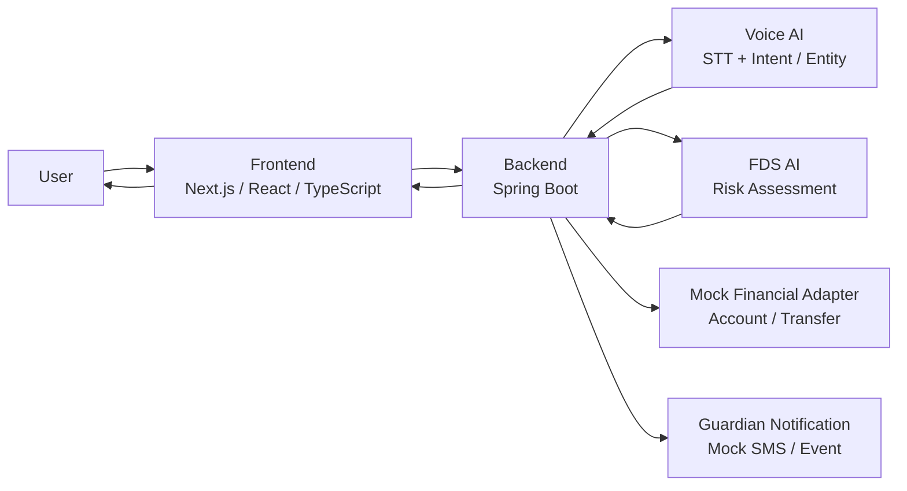
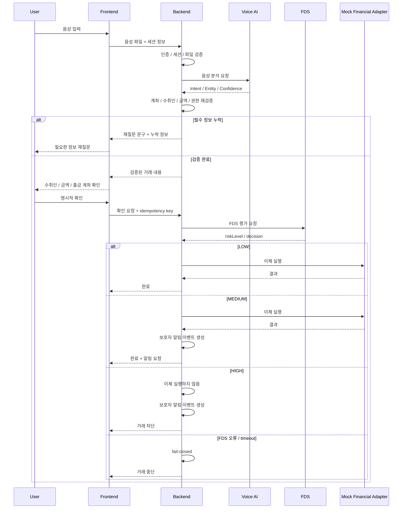
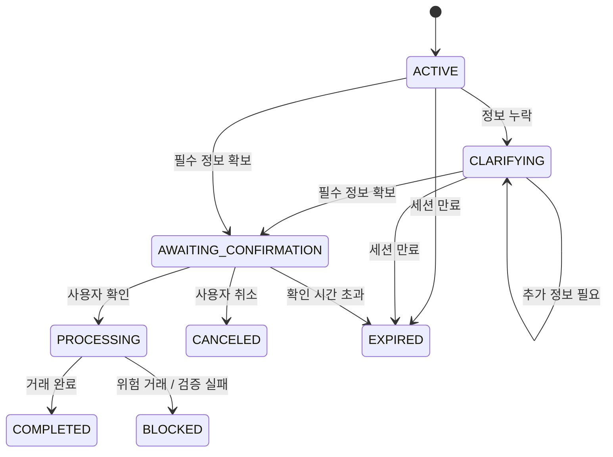

# MOVI Architecture

이 문서는 MOVI의 **전체 시스템 구조와 파트별 책임 경계**를 설명합니다.

목적은 기술 스택을 나열하는 것이 아니라,  
**왜 Frontend–Backend–AI를 분리했고, AI의 해석 결과가 실제 금융 실행까지 어떤 검증을 거치는지**를 보여주는 것입니다.

> 이 문서는 팀 전체 시스템을 설명합니다.  
> AI 서버와 AI 모델 구현은 별도 팀원이 담당했으며, 문하늘은 Frontend–Backend–AI 간 책임 경계와 통합 계약을 정리하고 Backend/Frontend 일부 흐름을 AI-assisted 방식으로 구현·검증했습니다.

---

## 1. Architecture Goal

MOVI에서 가장 중요한 설계 질문은 다음이었습니다.

> **음성 AI가 잘못 인식했을 때, 그 오류가 실제 금융 거래로 이어지지 않게 하려면 어디에서 다시 검증해야 하는가?**

이를 위해 MOVI는 역할을 다음처럼 나눴습니다.

- **Frontend**: 사용자의 입력과 결과 표현
- **AI**: 자연어/음성 해석
- **Backend**: 금융 상태와 실제 거래 실행의 최종 책임

핵심 원칙은 다음 한 문장으로 요약할 수 있습니다.

> **AI는 해석하고, Backend는 검증하고 실행한다.**

---

## 2. High-level Architecture



Frontend가 AI 서버나 FDS를 직접 호출하지 않고, 모든 금융 흐름은 Backend를 통과합니다.

---

## 3. Responsibility Boundary

| 영역 | Frontend | Backend | AI |
|---|---|---|---|
| 마이크 권한 / 녹음 | 담당 | 파일 검증 | 포맷 해석 |
| STT | 결과 표시 | 호출 / 오류 변환 | 담당 |
| Intent / Entity | 직접 판단하지 않음 | Schema / 필수값 재검증 | 담당 |
| 음성 세션 | 화면 상태 보관 | 생성 / 소유권 / 만료 | 받은 ID 사용 |
| 누락 정보 | 질문 표시 | 슬롯 저장 / 병합 / 재질문 결정 | 현재 발화 해석 |
| 실제 계좌 / 수취인 | 표시 | DB 조회 / 소유권 검증 | 조회하지 않음 |
| 거래 확인 | 확인 UI / TTS | 검증된 값으로 확인 내용 생성 | 후속 발화 분류 |
| FDS 입력 사실값 | 없음 | 수집 / 전달 | 평가 |
| 거래 실행 | 결과 표시 | 최종 책임 | 실행하지 않음 |
| 보호자 알림 | 상태 표시 | 이벤트 생성 / 요청 | 없음 |
| 금융 상태 | UI 표현 | 단일 소유자 | 변경하지 않음 |

이 분리를 통해 AI가 잘못된 값을 반환하더라도 곧바로 실제 거래가 실행되지 않도록 했습니다.

---

## 4. Voice Transfer Flow



---

## 5. Why Backend Re-validates AI Output

AI가 높은 confidence를 반환해도 다음 정보는 별도로 검증해야 합니다.

- 해당 계좌가 실제 로그인 사용자의 계좌인지
- 수취인이 실제로 등록되었거나 검증 가능한 대상인지
- 잔액이 충분한지
- 거래 한도를 넘지 않는지
- 세션이 만료되지 않았는지
- 사용자가 확인한 거래 내용과 실행 직전 값이 같은지

따라서 MOVI에서는 **AI confidence를 금융 검증의 대체 수단으로 사용하지 않습니다.**

AI의 역할은 언어 해석이고, 금융 사실의 최종 판단은 Backend가 담당합니다.

---

## 6. Conversation State

음성 송금은 단일 요청이 아니라 여러 발화가 이어질 수 있기 때문에 상태를 분리했습니다.



### 왜 상태를 Backend가 소유하나

Frontend와 AI가 각각 대화 상태를 따로 보관하면 다음 문제가 생길 수 있습니다.

- Frontend는 이전 금액을 기억하지만 Backend는 새 금액을 사용하는 경우
- AI가 예전 수취인을 유지하는 경우
- 확인 전에 값이 바뀌었는데 이전 확인이 그대로 유효한 경우

그래서 실제 거래와 연결되는 세션/슬롯/확인 상태는 Backend가 단일 소유하도록 했습니다.

---

## 7. Confirmation Integrity

송금에서 중요한 기준은 다음입니다.

> **사용자가 확인한 내용과 실제 실행되는 내용이 같아야 한다.**

따라서 수취인, 금액, 출금 계좌 등 핵심 거래 값이 바뀌면 이전 확인 상태를 그대로 재사용하지 않습니다.

```text
수취인 A / 50,000원 확인
        ↓
사용자가 금액을 100,000원으로 변경
        ↓
기존 확인 상태 폐기
        ↓
변경된 거래 내용을 다시 확인
        ↓
새 확인 후 실행
```

이 원칙은 음성 입력 오류가 실제 거래로 이어지는 위험을 줄이기 위한 것입니다.

---

## 8. Idempotency

금융 거래에서는 사용자가 버튼을 여러 번 누르거나, 네트워크 timeout으로 같은 요청이 다시 전송될 수 있습니다.

MOVI에서는 동일 거래 요청을 구분하기 위해 **idempotency key**를 사용합니다.

```text
사용자 확인
   ↓
Frontend에서 key 생성
   ↓
Backend 실행 요청
   ↓
응답 timeout
   ↓
동일 key로 상태 재확인 / 재요청
   ↓
동일 송금이 중복 실행되지 않도록 방어
```

이 구조는 “응답을 받지 못했다”와 “거래가 실행되지 않았다”를 같은 의미로 취급하지 않기 위한 것입니다.

---

## 9. FDS Boundary

FDS는 위험도를 평가하지만 실제 송금 실행 여부는 Backend가 결정합니다.

| 결과 | Backend 처리 |
|---|---|
| LOW | 거래 실행 |
| MEDIUM | 거래 실행 + 보호자 알림 요청 |
| HIGH | 거래 차단 + 보호자 알림 요청 |
| timeout / 5xx / 비정상 payload | 거래 중단 |

FDS가 실패했다고 해서 정상 거래로 간주하지 않습니다.

이 프로젝트에서는 이 원칙을 **fail-closed**로 정리했습니다.

---

## 10. Accessibility-related Architecture Decisions

MOVI는 음성을 유일한 입력 방식으로 만들지 않았습니다.

- 음성 기능에 키보드/터치 대안 유지
- 음성만으로 송금 완료 금지
- 거래 결과를 음성뿐 아니라 화면 텍스트로도 제공
- 음성 오류가 발생해도 사용자가 다시 시도하거나 다른 입력 방식으로 이동할 수 있도록 설계
- Frontend가 임의로 AI 계약을 만들지 않고 실제 Backend 계약을 기준으로 화면을 구성

실제 VoiceOver / TalkBack / 200% 확대 검증은 별도 validation 단계에서 수행할 예정입니다.

---

## 11. Mock vs. Real Boundary

MOVI는 실제 상용 금융 서비스가 아닙니다.

현재 포트폴리오에서 검증된 범위는 다음과 같습니다.

### 검증된 범위

- Frontend–Backend–AI 계약
- 음성 송금 상태 흐름
- 누락 정보 재질문
- 명시적 거래 확인
- FDS 분기
- idempotency
- Backend 금융 상태 검증
- Mock 금융 adapter를 이용한 이체 흐름

### 실제 운영으로 주장하지 않는 범위

- 실제 금융기관 OpenBanking 운영
- 실제 은행 계좌 송금 운영
- 실제 SMS 발송 운영
- 실제 시각장애 사용자 대상 서비스 운영
- AI 모델 운영/학습

---

## 12. Architecture Evidence

아키텍처와 책임 경계는 다음 GitHub 기록에서 확인할 수 있습니다.

- [Backend PR #3 — Front / AI / Backend 통합 명세 수립](https://github.com/movi-ai-challenge/movi_backend/pull/3)
- [Backend PR #35 — 음성 이체 명령 및 실행 흐름 구현](https://github.com/movi-ai-challenge/movi_backend/pull/35)
- [Frontend PR #14 — Backend-to-Frontend Contract Audit](https://github.com/movi-ai-challenge/movi_frontend/pull/14)
- [Frontend PR #28 — Direct Transfer API Flow 통합](https://github.com/movi-ai-challenge/movi_frontend/pull/28)
- [Backend Integration Specification](https://github.com/movi-ai-challenge/movi_backend/blob/main/docs/integration-spec.md)

개인 기여 범위는 [contribution.md](./contribution.md)에서 별도로 정리합니다.
